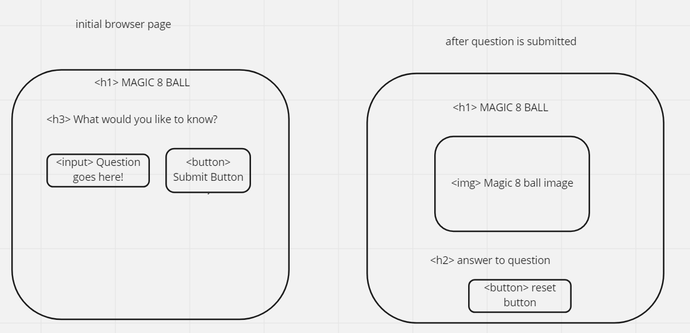

##HTML

<section>
*h1 header

h3 ask any question

input user question

button submit user question

\*section

h1 header

img image of magic 8 ball

p where the answer to the question appears

button reset button, ask another question

## Events

\*event listener for click for submit button

hide prompt

display img

pick random number of array using array.length

set 
 to display value of random answer of array

\*reset button

hides answer of array, img

shows input, button
